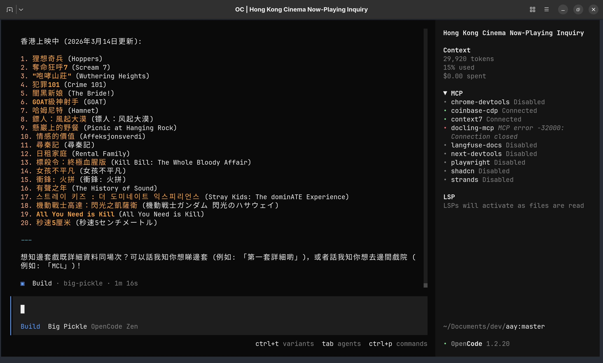
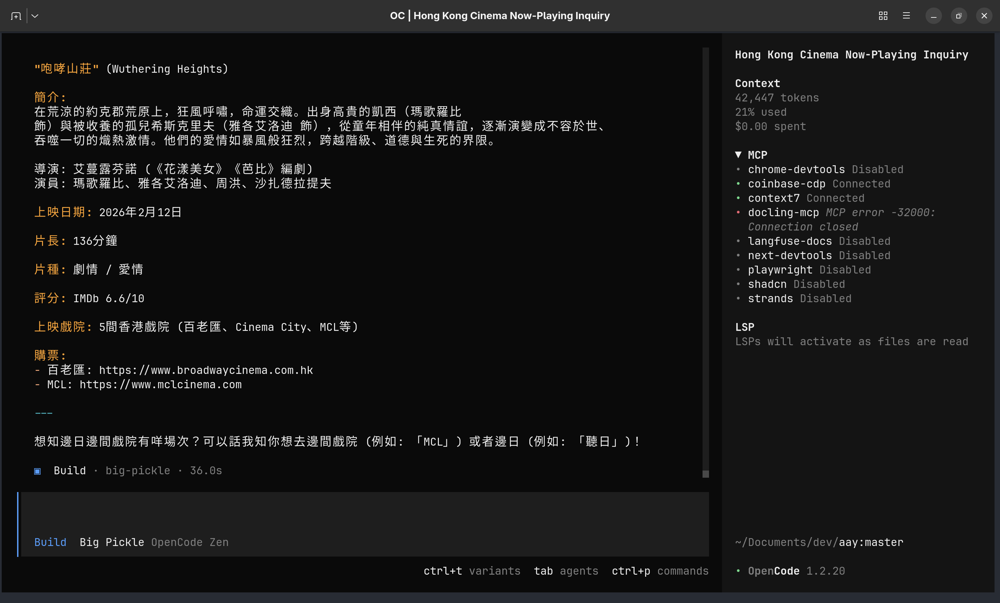
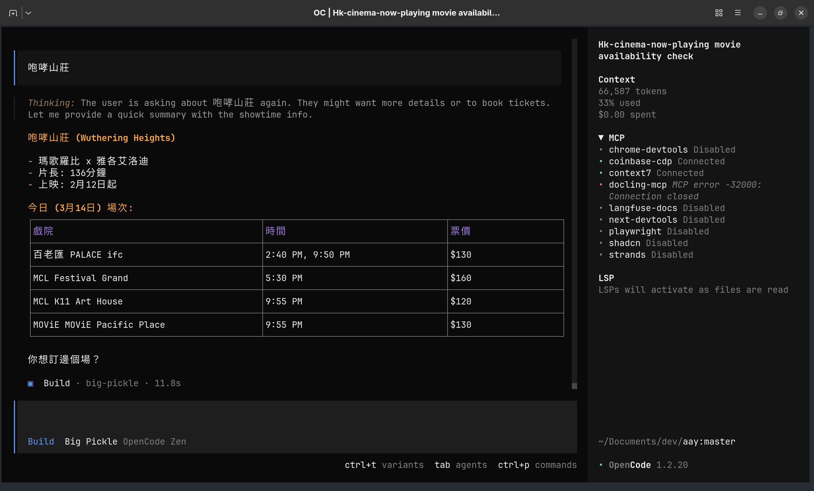
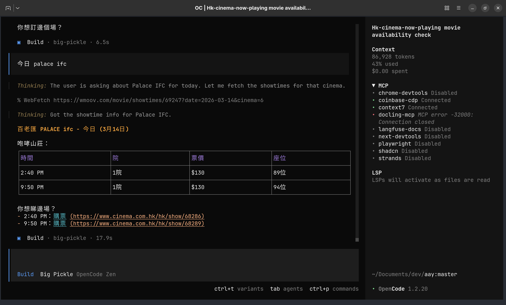

# aay – All Around You

Hong Kong cinema movie ticketing agent skills. 

## Skills

**hk-cinema-now-playing**: Fetches current HK cinema screenings with booking links.

    User Flow (chat with your ticketing agent):

    1. Ask the agent about what's currently showing
    2. Agent chats through the film options with overviews
    3. Tell the agent which film takes your fancy
    4. Agent lists which cinemas are screening it and when
    5. Pick your preferred cinema and showing
    6. Agent sends you straight to the cinema's booking page

## Screenshots









## Buy Me A Coffee

Your support helps keep this project and future open‑source efforts going.

```
0x1e052453c89b5ee5C37E9c62dAAAcb407AEde125
```


## API Keys

Copy `.env.example` to `.env` and add:

- `TMDB_API_KEY` – TMDB Read Access Token
- `RAPIDAPI_KEY` – RapidAPI key (IMDB data)
- `X-Api-Key` – International Showtime API key

## Misc

```
@misc{aay,
  author = {{errchh}},
  title = {aay - All Around You},
  description = {Hong Kong cinema movie ticketing agent skills},
  month = {March},
  year = {2026},
  url = {https://github.com/errchh/aay}
}
```
